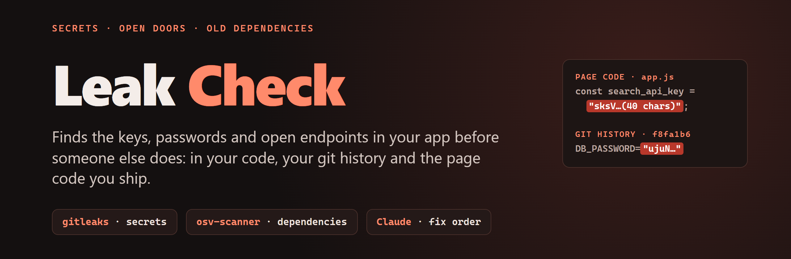
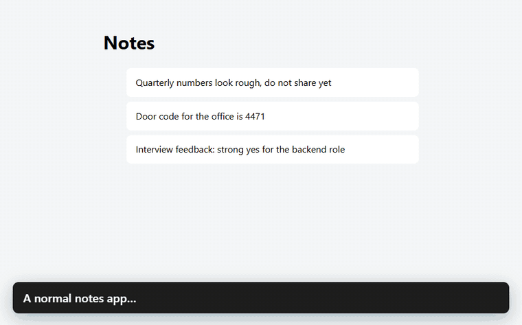
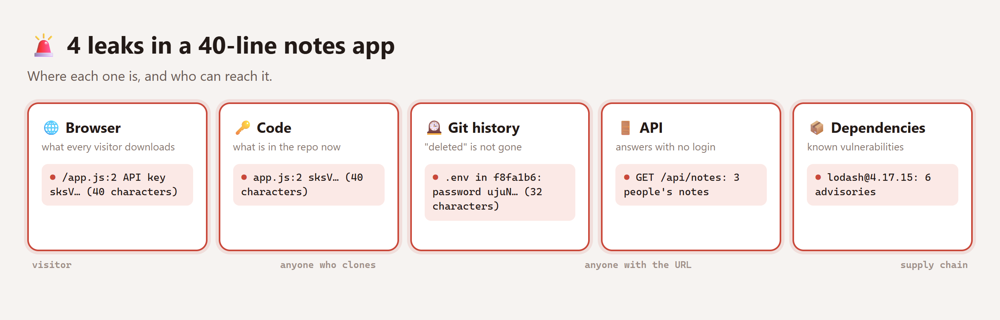
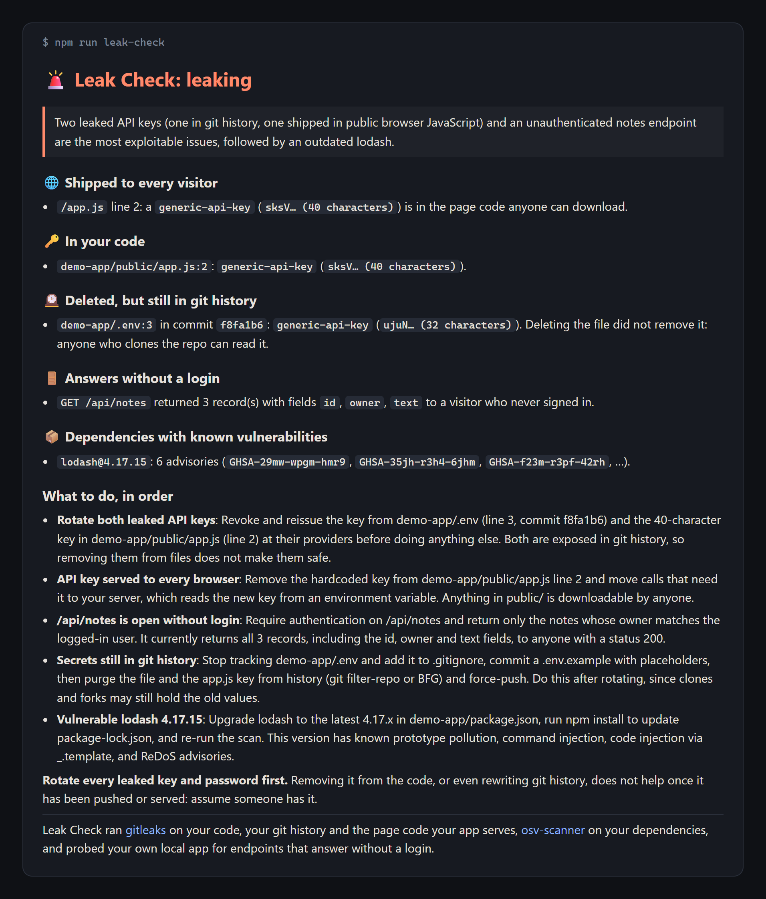

<p align="center"></p>

**Leak Check** finds the secrets and open doors in your app before someone else does, and tells you what to fix first.

AI-built apps leak in the same few ways, again and again: an API key bundled into the page every visitor downloads, a password "deleted" from the repo that still sits in git history, an endpoint that answers anyone without a login. Leak Check looks in all of those places at once.

<p align="center"></p>

## What it found in a 40-line app

The [demo app](demo-app/) is a tiny notes app with the mistakes that keep showing up in real breaches:

<p align="center"></p>

- 🌐 **An API key in the page code.** Anything in `public/` is downloadable by every visitor.
- 🕰️ **A password in git history.** The `.env` file was deleted in a later commit, but anyone who clones the repo can still read it.
- 🚪 **An endpoint that answers without a login.** `GET /api/notes` returns everyone's notes to a stranger.
- 📦 **A dependency with known vulnerabilities.** `lodash@4.17.15` has six published advisories.

Then it puts the fixes in the order an attacker would exploit them, starting with the one that matters most: **rotate the leaked keys**. Deleting a secret does not help once it has been pushed or served.

<p align="center"></p>

## What it checks

| Where | How |
| --- | --- |
| Your code, including files you have not committed yet | [gitleaks](https://github.com/gitleaks/gitleaks) |
| Every commit in your git history | gitleaks |
| The page code your running app actually serves | Fetches your **local** app's scripts and runs gitleaks on them |
| API endpoints that answer without a login | Calls the paths you list, with no credentials, on your **local** app |
| Dependencies with known vulnerabilities | [osv-scanner](https://github.com/google/osv-scanner) |
| What to fix first | [Claude Code](https://claude.com/claude-code), optional (`--no-ai`) |

## Try it

You need Node.js 24.8 or newer, git, and the two scanners on your `PATH`:

```bash
brew install gitleaks osv-scanner                        # macOS / Linux with Homebrew
# or, with Go:
go install github.com/gitleaks/gitleaks/v8@latest
go install github.com/google/osv-scanner/v2/cmd/osv-scanner@latest
# or download them from their GitHub releases pages and check the published checksums
```

Then:

```bash
git clone https://github.com/Today-In-Ai-Builds/leak-check && cd leak-check
npm run demo-app          # in one terminal: the leaky notes app on 127.0.0.1:4322
npm run leak-check        # in another: writes leak-check-report.md, exits 1 if anything leaks
```

The fix order uses Claude Code on your own plan. Run with `--no-ai` to skip it; the scan itself does not need it.

**On your own project**, copy the `leak-check/` folder and edit `leak-check.config.json`:

```json
{ "app": "http://127.0.0.1:3000", "probe": ["/api/users", "/api/orders"] }
```

`probe` lists endpoints that should need a login. Leak Check calls each one with no credentials and flags any that return records.

## What it will not do

- **Scan someone else's site.** The live checks only run against `localhost`, `127.0.0.1` or `*.localhost`, and probe paths must be plain paths. Scanning sites you do not own without permission is not security research.
- **Show you a secret.** Secrets are redacted as soon as the scanners report them. The report shows at most the first four characters of a long key and only the length of anything shorter. That preview is all the AI step ever sees.
- **Let the scanned repo grade itself.** gitleaks and osv-scanner run with Leak Check's own configs. A repo's `.gitleaks.toml`, `.gitleaksignore` or `osv-scanner.toml` cannot allowlist its own leaks.
- **Call a failed check clean.** If a scanner cannot run, or your app returns an error page, Leak Check stops with exit code 2 instead of reporting nothing found.
- **Give the AI any tools.** Claude Code runs with `--tools ""` and `--safe-mode`: no commands, no files, no network, none of your plugins. Names from your repo are passed to it as data and escaped in the report.

## The demo app

[`demo-app/`](demo-app/) is **deliberately insecure. Never deploy it.** Its key and password are random strings generated for this repo, not credentials for any real service. Its `lodash` dependency is listed so osv-scanner has something to find, and it is never installed or run.

## Credits

| Project | What it does here | License |
| --- | --- | --- |
| [gitleaks/gitleaks](https://github.com/gitleaks/gitleaks) | Finds secrets in code, history and served pages | MIT |
| [google/osv-scanner](https://github.com/google/osv-scanner) | Finds dependencies with known vulnerabilities | Apache-2.0 |
| [Claude Code](https://claude.com/claude-code) | Orders the fixes (optional) | Anthropic terms |

Leak Check's own code is [MIT](LICENSE).

---

Built for a *Today in AI* episode. Also from this series: [Ship Check](https://github.com/Today-In-Ai-Builds/ship-check), which reviews pull requests. This is a demo, not a maintained product: issues and pull requests may not get answers.
